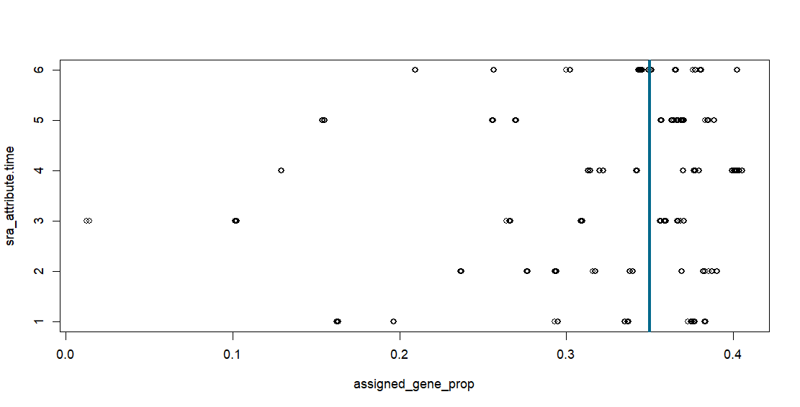

# RNA-Seq Analysis Project
## Valentina Janet Arias Ojeda
# Abstract & Overview

This project aims to apply the knowledge acquired in the "Análisis de datos de Secuenciación Masiva" module in the Bioinformatics and Statistics II course to perform a comprehensive RNA-Seq analysis.

## Data Overview

The dataset was obtained from the study: **“Transcriptomic analyses reveal rhythmic and CLOCK-driven pathways in human skeletal muscle.”**

Abstract: “The circadian regulation of transcriptional processes has a broad impact on cell metabolism. Here, we compared the diurnal transcriptome of human skeletal muscle conducted on serial muscle biopsies in vivo with profiles of human skeletal myotubes synchronized in vitro. Extensive rhythmic transcription was observed in human skeletal muscle in comparison to in vitro cell culture. However, nearly half of the in vivo rhythmicity was lost at the mRNA accumulation level. Genes involved in GLUT4 expression, translocation and recycling were negatively affected, whereas lipid metabolic genes were altered to promote activation of lipid utilization.  Overall design: 10 candidates with 6 biopsies each for a total of 57 samples being sequenced. Together with GSE109825, part of the same study described above.”
# Methodology

## 1. Requirements

### 01_librerias.R

The code provided in the document includes the necessary libraries for the R analysis. These libraries are used to import and manipulate the data, perform statistical analysis, and create visualizations. The libraries used in the analysis are:

- `recount3`: A package for accessing and analyzing RNA-Seq data from the recount3 project.
- `edgeR`: A package for differential expression analysis of RNA-Seq data.
- `limma`: A package for linear models and differential expression analysis.
- `ggplot2`: A package for creating visualizations in R.
- `pheatmap`: A package for creating heatmaps.
- `iSEE` : Interactive data visualization and analysis of RNA-Seq data.

### 02_getData.R

The script `02_getData.R` is responsible for downloading the data of the study from the recount3 project. It uses the `create_rse` function to create an object called `rse_gene_SRP127581`, which contains the RNA-Seq data from the study with the project code "SRP127581" and project type "data_sources". This script ensures that the necessary data is obtained for further analysis in the project.

```r
## Proyectos disponibles
human_projects <- available_projects()
## Subset
rse_gene_SRP127581 <- create_rse(
  subset(
    human_projects,
    project == "SRP127581" & project_type == "data_sources"
  )
)
```

Additionally, it also converts raw counts to read counts.

```r
## Convertir las cuentas crudas a cuentas por lectura
assay(rse_gene_SRP127581, "counts") <- compute_read_counts(rse_gene_SRP127581)
## Ver
#rse_gene_SRP127581$sra.sample_attributes
```
## 2. Data Overview & Preparation

The `rse_gene_SRP127581` object contains a total of 454 samples and 3 columns with the following information:

1. Source Name: Biopsies from the vastus lateralis.
2. Time of Day: The samples collected at various times throughout the day.
3. Tissue: Specifies the tissue type, which in this case is the vastus lateralis.

```r
rse_gene_SRP127581$sra.sample_attributes
  [1] "source_name;;biopsys from the vastus lateralis|time;;12:00|tissue;;vastus lateralis"
  [2] "source_name;;biopsys from the vastus lateralis|time;;12:00|tissue;;vastus lateralis"
  [3] "source_name;;biopsys from the vastus lateralis|time;;12:00|tissue;;vastus lateralis"
  [4] "source_name;;biopsys from the vastus lateralis|time;;12:00|tissue;;vastus lateralis"
```

## 03_filtering.R

The script `03_filtering.R` is responsible for performing data processing and corrections needed to continue the analysis.

The `expand_sra_attributes` function to process the information provided by SRA. This function expands the attributes, separates them, and incorporates them into the data frame.

After expanding the attributes, the script separates them and changes the data type of the attributes to factor.

```r
## Procesar la información como la provee SRA, expandirla, separar los atributos e incorporarlos al data frame. . 
rse_gene_SRP127581 <- expand_sra_attributes(rse_gene_SRP127581)

colData(rse_gene_SRP127581)[
  ,
  grepl("^sra_attribute", colnames(colData(rse_gene_SRP127581)))
]

## Cambiar el tipo de dato a factor 
rse_gene_SRP127581$sra_attribute.time <- factor(rse_gene_SRP127581$sra_attribute.time)
rse_gene_SRP127581$sra_attribute.source_name <- factor(rse_gene_SRP127581$sra_attribute.source_name)
rse_gene_SRP127581$sra_attribute.tissue <- factor(rse_gene_SRP127581$sra_attribute.tissue)
```

First, the proportion of reads to genes was calculated by dividing the assigned gene counts by the total gene counts.

```r

rse_gene_SRP127581$assigned_gene_prop <- rse_gene_SRP127581$recount_qc.gene_fc_count_all.assigned / rse_gene_SRP127581$recount_qc.gene_fc_count_all.total
```

 A summary of the assigned gene proportion for each time group was then obtained. The quality of the data was visualized by plotting the assigned gene proportion against the time group, with a cutoff value of 0.35 indicated by a horizontal line. A histogram was also created to visualize the distribution of the assigned gene proportion. 

```r
## Resumen por grupo de tiempo
with(colData(rse_gene_SRP127581), tapply(assigned_gene_prop, sra_attribute.time, summary))

## Visalizar calidad de manera gráfica
with(colData(rse_gene_SRP127581), plot(assigned_gene_prop, sra_attribute.time))
abline(v = 0.35, col = "deepskyblue4", lwd = 4, lty = "solid")
## Histrograma
hist(rse_gene_SRP127581$assigned_gene_prop, col="gray")
abline(v=0.35,col="purple", lwd=7, lty = "dashed")
```

The cutoff value of 0.35 was chosen to filter out samples with a low proportion of reads assigned to genes and samples with an assigned gene proportion below this value were removed from the dataset. 

```r
## copia de seguridad
rse_gene_SRP127581_copia<-rse_gene_SRP127581

## Elección de un valor de corte y eliminación de muestras con proporción menor a 0.35
table(rse_gene_SRP127581$assigned_gene_prop < 0.35)

## Eliminar las muestras con proporción menor a 0.35
rse_gene_SRP127581 <- rse_gene_SRP127581[, rse_gene_SRP127581$assigned_gene_prop > 0.35]
```

The average expression levels of genes were calculated, and genes with mean expression levels less than 0.1 were eliminated.

```r
summary(gene_means)
     Min.   1st Qu.    Median      Mean   3rd Qu.      Max. 
      0.0       0.0       0.1      64.0       3.6 1171873.9
```

 The percentage of retained genes was calculated as a comparison to the original dataset.

```r
# Porcentaje de genes retenidos.
> round(nrow(rse_gene_SRP127581) / nrow(rse_gene_SRP127581_copia) * 100, 2)
[1] 50.8
```

By performing these steps, the script ensures that the subsequent analysis is based on reliable and meaningful gene expression data, allowing for accurate interpretation of the results. The percentage of retained genes after data filtering was 50.8%.
## 04_normalization.R

The `DGEList` function is used to create a DGEList object. The `counts` argument specifies the count data obtained from the `rse_gene_SRP127581` object using the `assay` function with "counts" as the second argument. The `genes` argument specifies the gene information obtained from the `rse_gene_SRP127581` object using the `rowData` function.

Next, the `calcNormFactors` function is applied to the DGEList object (`dge`) to calculate normalization factors. This step ensures that the gene expression data is adjusted for differences in library sizes and other factors that could affect the analysis.

## 3. Differential Expression Analysis

## 05_analysis.R

The script is intended to visualize the notable parts of the dataset as the final step of the analysis.

1. Visualize the distribution of the assigned gene proportion across different time points through a boxplot.

Next, we design a statistical model using the counts of reads per million (log2 counts per million). This model creates a design matrix that incorporates the time attribute and the assigned gene proportion.

```r
design <- model.matrix(~0 + sra_attribute.time + assigned_gene_prop, data = colData(rse_gene_SRP127581))
design
           sra_attribute.time00:00 sra_attribute.time04:00 sra_attribute.time08:00 sra_attribute.time12:00 sra_attribute.time16:00 sra_attribute.time20:00 assigned_gene_prop
SRR6422337                       0                       0                       0                       1                       0                       0          0.3761391
SRR6422338                       0                       0                       0                       1                       0                       0          0.3759950
SRR6422339                       0                       0                       0                       1                       0                       0          0.3763241
SRR6422340                       0                       0                       0                       1                       0                       0          0.3761964
```

The `voom` function is used to estimate the average variance of the gene expression data. This function also transforms count data into log-counts per million (logCPM) values

```r
## Estimacion de la varianza promedio
vGene <- voom(dge, design, plot = TRUE)
```


Then the `eBayes` function is used to calculate Bayesian statistics for differential expression analysis. This step is crucial for identifying genes that show significant differential expression between different conditions or time points. 

```r
fit_bayes <- eBayes(lmFit(vGene))
plotMA(fit_bayes, coef = 4, col = "steelblue")
```

The statistical results obtained from the linear model fit (`fit`) are adjusted to incorporate the uncertainty in the estimated variances. This allows for more accurate identification of differentially expressed genes based on their fold change and statistical significance.


We are using `coef = "sra_attribute.time12:00"` in the analysis because the initial boxplot showed that the assigned gene proportion at 12:00 has a notable difference compared to other time points. By focusing on this specific time point, we can identify any potential differential expression patterns that may be relevant to our research question.

Then the **volcano plot** highlights the genes with a fold change greater than a specified threshold.

```r
volcanoplot(fit_bayes, coef = "sra_attribute.time12:00", highlight = 5, names = results$gene_name, col = "steelblue", hl.col="hotpink4")
```


Then we focus on the top 30 genes with higher logFC to visualize their expression in a **heatmap.**


The log fold change (LFC) is a metric that describes how much gene expression changes between two conditions or groups. It is calculated by taking the logarithm of the ratio of gene expressions between the two conditions.

We visualize genes exhibiting a higher rate of change in the heatmap, enabling us to conduct further investigations into their functions.

## References
1. A Bioconductor-style differential expression analysis powered by SPEAQeasy. (n.d.). Retrieved from https://research.libd.org/SPEAQeasyWorkshop2023/articles/SPEAQeasyWorkshop2023.html#differential-expression-analysis-1
2. Laurent Perrin, Ursula Loizides-Mangold, Stéphanie Chanon, Cédric Gobet, Nicolas Hulo, Laura Isenegger, Benjamin D Weger, Eugenia Migliavacca, Aline Charpagne, James A Betts, Jean-Philippe Walhin, Iain Templeman, Keith Stokes, Dylan Thompson, Kostas Tsintzas, Maud Robert, Cedric Howald, Howard Riezman, Jerome N Feige, Leonidas G Karagounis, Jonathan D Johnston, Emmanouil T Dermitzakis, Frédéric Gachon, Etienne Lefai, Charna Dibner (2018) Transcriptomic analyses reveal rhythmic and CLOCK-driven pathways in human skeletal muscle.
3. Wikipedia. (n.d.). Empirical Bayes method. Web site: https://en.wikipedia.org/wiki/Empirical_Bayes_method#:~:text=Empirical Bayes methods are procedures,before any data are observed.
    
